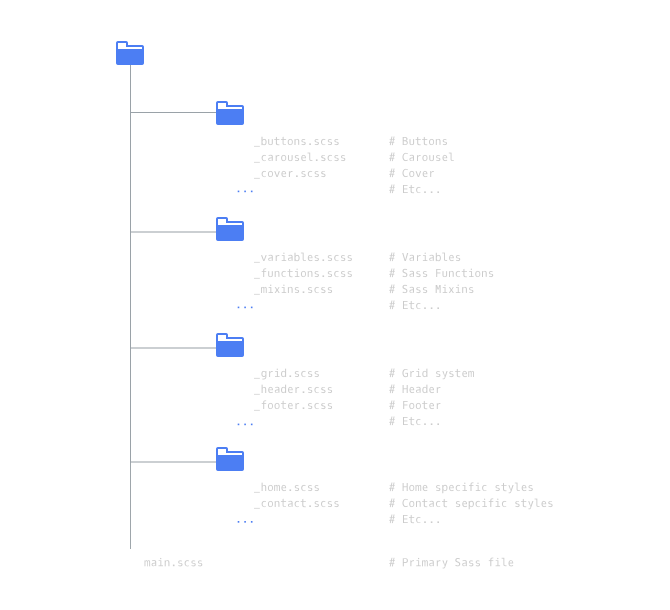

# SASS Masterclass

## Introduction

**Sass**, or Syntactically Awesome Style Sheets, is an extension language for CSS. With Sass, you can write clean, sustainable CSS code and solve the common repetition and maintenance challenges present in traditional CSS.

In addition to being a valuable skill for any front-end developer, transitioning from CSS to Sass is pretty smooth due to the familiar syntax. For this reason, we will be learning the **SCSS** (Sassy CSS) syntax.

## Create a Sass Stylesheet

### Compiling Sass

Sass can’t be directly interpreted by your browser, so it must first be converted, or compiled, to CSS before the browser can directly understand it.

Compiling refers to converting code to lower level code so that it can be executed. By compiling SCSS to CSS, it can be interpreted by your browser and the results will appear on a webpage.

Before we dive into writing Sass, let’s first learn how to compile it to CSS by typing the following command in the terminal and pressing enter:

```bash
sass main.scss main.css
```

The sass command above takes in two arguments:

1. The input (main.scss)
2. The location of where to place that output (main.css)

Make sure to look closely at the extensions of each file in the command above.

#### Instructions

1. In the terminal, compile the SCSS to CSS by typing the following command and hitting Enter on your keyboard:

```
sass main.scss main.css
```

Compare the output in main.css to the input in main.scss.

2. From this point on, any Sass code you write will be auto-compiled anytime you saving your code. This will allow us to focus strictly on writing code.

Even though you won’t be compiling the code manually everytime you write Sass in this course, be aware that it’s happening for you in the background.

### Sass: Overview

Let’s get started! Sass has many perks that enable us to write succinct, readable code. In this lesson we will explore three concepts:

- Variables
- Mixins
- Nests

In the process, you’ll use Sass to style your very own website for a lemonade stand.

#### Instructions

Take a look at the Sass code in **main.scss** and compare it to the CSS equivalent in **main.css**. What differences do you notice?

Hint: Both versions produce the same effects!

We will be editing these files to style the website appropriately.

### Nesting Selectors

The first Sass construct we will learn about is nesting.

Nesting is the process of placing selectors inside the scope of another selector:

- In programming, a variable’s scope is the context in which a variable is defined and available to use.

- In Sass, it’s helpful to think of the scope of a selector as any of the code between its opening { and closing } curly brackets.

- Selectors that are nested inside the scope of another selector are referred to as children. The former selector is referred to as the parent. This is just like the relationship observed in HTML elements.

```css
.parent {
  color: blue;
  .child {
    font-size: 12px;
  }
}
```

In the example above .child is the child selector and .parent is the parent selector.

The above SCSS would compile to the following, equivalent CSS:

```css
.parent {
  color: blue;
}
 
.parent .child {
    font-size: 12px;
}
```

Nesting allows you to see the clear DOM relationship between two selectors while also removing the repetition observed in CSS.

#### Instructions

1. In **main.scss**, inside of the *.banner* class selector, nest the following:

```css
.slogan {
  position: absolute;
  border: 4px solid black;
  top: 200px;
  left: 25%;
  width: 50%;
  height: 200px;
  text-align: center;
}
```

Click "Save" to see your changes in the browser and inspect the output in **main.css**.

See how much more clear and efficient nesting is? With Sass, you can avoid repeating the parent over and over again and also avoid definining each selector independently.

2. In main.scss, nest in the following span selector inside of .slogan:

```css
span {
  font-size: 24px;
  line-height: 200px;
}
```

Click "Save" to see your changes in the browser and inspect the output in **main.css**.

3. Practice makes perfect! In **main.scss**, nest the following selector inside of *.container*:

```css
.icon {
  display: inline-block;
  margin: 2%;
  border: 4px solid black;
  font-size: 32px;
}
```

Click "Save" to see your changes in the browser and inspect output in **main.css**.

### Nesting Properties

Congrats, you’ve written your first nested selectors!

In SCSS, nesting is not limited only to selectors. You can also nest common CSS properties if you append a : colon suffix after the name of the property.

For example, the following SCSS code:

```css
.parent {
  font : {
    family: Roboto, sans-serif;
    size: 12px;
    decoration: none;
  }
}
```

will compile to the following CSS:

```css
.parent {
  font-family: Roboto, sans-serif;
  font-size: 12px;
  font-decoration: none;
}
```
#### Instructions

1. In **main.scss**, nest the following properties inside of *.banner*:

```css
border : {
    top: 4px solid black;
    bottom: 4px solid black;
}
```

Click "Save" to see your changes in the browser and view the output in **main.css**.

### Variables In Sass

Variables in SCSS allow you to assign an identifier of your choice to a specific value.

Why is that useful? Unlike in CSS, if you need to tweak a value, you’ll only have to update it in one place and the change will be reflected in multiple rules.

In Sass, **$** is used to define and reference a variable:

```scss
$translucent-white: rgba(255,255,255,0.3);
```

**Note:** It’s important to stick to one naming convention for variables when you first build out your codebase. This will help you reference them easily in the future.

#### Instructions

1. At the top of main.scss, create a new variable:

```scss
$translucent-white: rgba(255,255,255,0.3);
```

Reference that variable as the value for the *background-color* property inside the *.slogan* selector:

```scss
background-color: $translucent-white;
```

Click "Save" to see your changes in the browser and inspect the output in **main.css**.

### Sass(y) Types

There are different data types you can assign to a variable in CSS.

In addition to the color data type we have seen, there are also:

1. Numbers, such as *8.11*, *12*, and *10px*. Notice that while *10* has a unit of *px* associated with it, it is still considered a number.

2. Strings of text, with and without quotes. Some examples are *"potato"*, *'tomato'*, *span*.

3. Booleans, or simply *true* and *false*.

4. null, which is considered an empty value.

#### Instructions

1. In main.scss, make a variable of type number at the top of your file:

```scss
$icon-square-length: 300px;
```

Add the following inside the class selector *.icon*:

```scss
width: $icon-square-length;
height: $icon-square-length;
```

Click "Save" to see your changes in the browser and inspect output in **main.css**.

### Maps & Lists

In addition to color, numbers, strings, booleans, and null, Sass also has two other data types, lists and maps.

- Lists can be separated by either spaces or commas. For example, the following list denotes font properties, such as:

```
1.5em Helvetica bold;
```
or
```
Helvetica, Arial, sans-serif;
```

**Note:** You can also surround a list with parentheses and create lists made up of lists.

- Maps are very similar to lists, but instead each object is a key-value pair. The typical map looks like:

```
(key1: value1, key2: value2);
```

**Note:** In a map, the value of a key can be a list or another map.

#### Instructions

1. At the top of main.scss, create a new list variable:

```scss
$standard-border: 4px solid black;
```

Find all of the instances that use *4px solid black* in **main.scss** and replace them with the *$standard-border* variable reference. You’ve been using a list and you didn’t even know it!

Click "Save" to see your changes in the browser and inspect output in **main.css**.

### Review

1. **Nesting** is the process of placing child selectors and properties in the scope of a parent selector. This allows a programmer to draw DOM relationships and avoid repetition.

2. **Variables** make it easy to update code and reference values by allowing you to assign an identifier to a value.

3. Sass **Data Types** include:

- Numbers
- Strings
- Booleans
- null
- Lists
- Maps
Nesting and variables are just two ways that Sass keeps stylesheets clean. In the next unit, you’ll learn about other Sass constructs that serve the same purpose.

## Mixins and the & Selector

### The & Selector in Nesting

In the next set of exercises, you’ll use new Sass concepts to fix and add styles to the notecard on the right so that it flips when you hover over it!

Recall that, in CSS, a pseudo-element is used to style parts of an element, for example:

- Styling the content *::before* or *::after* the content of an element.

- Using a pseudo class such as *:hover* to set the properties of an element when the user’s mouse is touching the area of the element.

In Sass, the *&* character is used to specify exactly where a parent selector should be inserted. It also helps write pseudo classes in a much less repetitive way.

For example, the following Sass:

```scss
.notecard{ 
  &:hover{
      @include transform (rotatey(-180deg));  
    }
  }
```

will compile to the following CSS:

```scss
.notecard:hover {
  transform: rotatey(-180deg);
}
```

#### Instructions

1. In **main.scss**, inside of *.notecard*, nest and invoke the following *&* selector:

```scss
&:hover{
  @include transform (rotatey(-180deg));  
}
```

Click "Save" to see your changes in the browser and inspect them in the output of main.css. Hover over your card and watch the contents rotate! We will be styling it further in the next exercises.

### What is a Mixin?

In addition to variables and nesting, Sass has multiple constructs that reduce repetition.

In Sass, a mixin lets you make groups of CSS declarations that you want to reuse throughout your site.

The notation for creating a mixin is as follows:

```scss
@mixin backface-visibility {
  backface-visibility: hidden;
  -webkit-backface-visibility: hidden;
  -moz-backface-visibility: hidden;
  -ms-backface-visibility: hidden;
  -o-backface-visibility: hidden;
}
```
**Note:** Mixin names and all other Sass identifiers use hyphens and underscores interchangeably. The following code:

```scss
.notecard {
  .front, .back {
    width: 100%;
    height: 100%;
    position: absolute;
 
    @include backface-visibility;
  }
} 
```

is equivalent to the following CSS:

```scss
.notecard .front, .notecard .back {
  width: 100%;
  height: 100%;
  position: absolute;
 
   backface-visibility: hidden;
  -webkit-backface-visibility: hidden; 
  -moz-backface-visibility: hidden;
  -ms-backface-visibility: hidden;
  -o-backface-visibility: hidden;
}
```

### Instructions

1. At the top of **main.scss**, create the following mixin:

```scss
@mixin backface-visibility {
  backface-visibility: hidden;
  -webkit-backface-visibility: hidden;
  -moz-backface-visibility: hidden;
  -ms-backface-visibility: hidden;
  -o-backface-visibility: hidden;
}
```

Next, include the mixin inside the joint *.front, .back* selector:

```scss
.front, .back {
  width: 100%;
  height: 100%;
  position: absolute;
  @include backface-visibility;
}
```

**Note:** *backface-visibility* is a vendor specific property that is perfect for mimicking an index card with a front and a back.

Click "Save" to see your changes in the browser and inspect them in **main.css**. Hover over you card and see the effects of a hidden backface in motion.

### Mixins: Arguments

Mixins also have the ability to take in a value.

An argument, or parameter, is a value passed to the mixin that will be used inside the mixin, such as *$visibility* in this example:

```scss
@mixin backface-visibility($visibility) {
  backface-visibility: $visibility;
  -webkit-backface-visibility: $visibility;
  -moz-backface-visibility: $visibility;
  -ms-backface-visibility: $visibility;
  -o-backface-visibility: $visibility;
}
```

In fact, you should only ever use a mixin if it takes an argument. We will learn more about this in a later exercise.

The syntax to pass in a value is as follows:

```scss
@include backface-visibility(hidden);
```

In the code above, *hidden* is passed in to the *backface-visibility* mixin, where it will be assigned as the value of its argument, *$visibility*.

#### Instructions

1. In **main.scss**, modify *backface-visibility* mixin to take in a parameter, like so:

```scss
@mixin backface-visibility($visibility) { //Add an argument
  backface-visibility: $visibility;
  -webkit-backface-visibility: $visibility;
  -moz-backface-visibility: $visibility;
  -ms-backface-visibility: $visibility;
  -o-backface-visibility: $visibility;
}
```
Pass in the value of *hidden* inside the *.front, .back* selector:

```scss
.front, .back {
    @include backface-visibility(hidden);
}
```

Click "Save" to see your changes in the browser and inspect them in **main.css**.

### Default Value Arguments

Mixin arguments can be assigned a default value in the mixin definition by using a special notation.

A default value is assigned to the argument if no value is passed in when the mixin is included. Defining a default value for each argument is optional.

The notation is as follows:

```scss
@mixin backface-visibility($visibility: hidden) {
   backface-visibility: $visibility;
  -webkit-backface-visibility: $visibility;
  -moz-backface-visibility: $visibility;
  -ms-backface-visibility: $visibility;
  -o-backface-visibility: $visibility;
}
```
In the example above, if no value is passed in when *backface-visibility* is included, *hidden* would be assigned to all properties.

#### Instructions
1. In **main.scss** add a default value of *hidden* to the argument in *backface-visibility*:

```scss
@mixin backface-visibility($visibility: hidden) {
  // Backface properties
}
```

Inside of .*front, .back* remove the argument you previously passed to *backface-visibility*.

Click "Save" to see your changes in the browser and inspect them in the output of **main.css**.

### Mixin Facts

In general, here are 5 important facts about arguments and mixins:

1. Mixins can take multiple arguments.
2. Sass allows you to explicitly define each argument in your *@include* statement.
3. When values are explicitly specified you can send them out of order.
4. If a mixin definition has a combination of arguments with and without a default value, you should define the ones with no default value first.
5. Mixins can be nested.

Here are some concrete examples of the rules:

```scss
@mixin dashed-border($width, $color: #FFF) {
  border: {
     color: $color;
     width: $width;
     style: dashed;
  }
}
 
span { //only passes non-default argument
    @include dashed-border(3px);
}
 
p { //passes both arguments
    @include dashed-border(3px, green);
}
 
div { //passes out of order but explicitly defined
   @include dashed-border(color: purple, width: 5px); 
}
```
In the example above, the color of the border of *span* elements would be white, the border of *paragraph* elements would be green, while the *div* elements would have a thicker purple border.

#### Instructions

1. Practice makes perfect! In **main.scss** inside of the *.back* selector, include the following:

```scss
@include transform(rotatey(-180deg));
```

Click "Save" to see your changes in the browser and inspect them in the output of **main.css**.

2. In addition to flipping the back, we also want to make sure that the notecard preserves a 3D effect during all of its transformations. At the top of **main.scss**, add the following mixin:

```scss
@mixin transform-style($style){
   transform-style: $style;
  -moz-transform-style: $style;
  -o-transform-style: $style;
  -ms-transform-style: $style;
  -webkit-transform-style: $style;
}
```
Invoke the mixin inside of *.notecard*, add the following:

```scss
@include transform-style(preserve-3d);
```

Click "Save" to see your changes in the browser and inspect them in the output of **main.css**.

3. Last but not least, add the following at the top of **main.scss**:

```scss
@mixin transition($time){
  transition: $time;
  -webkit-transition: $time;
  -moz-transition: $time;
  -o-transition: $time;
}  
```
Add the following inside the *.notecard* selector:

```scss
@include transition(0.4s);
```

Click "Save" to see your changes in the browser and inspect them in the output of **main.css**.

### List Arguments

Sass allows you to pass in multiple arguments in a list or a map format.

For example, take the multiple properties needed to create the college-ruled stripes in the back of our notecard.

```scss
@mixin stripes($direction, $width-percent, $stripe-color, $stripe-background: #FFF) {
  background: repeating-linear-gradient(
    $direction,
    $stripe-background,
    $stripe-background ($width-percent - 1),
    $stripe-color 1%,
    $stripe-background $width-percent
  );
}
```
In this scenario, it makes sense to create a map with these properties in case we ever want to update or reference them.

```scss
$college-ruled-style: ( 
    direction: to bottom,
    width-percent: 15%,
    stripe-color: blue,
    stripe-background: white
);
```
When we include our mixin, we can then pass in these arguments in a map with the following *...* notation:

```scss
.definition {
      width: 100%;
      height: 100%;
      @include stripes($college-ruled-style...);
 }
```

**Note:** Remember to always prioritize readability over writing less code. This approach is only useful if you find it adds clarity to your codebase.

#### Instructions

1. At the top of **main.scss**, make a new list variable:

```scss
$stripe-properties: to bottom, 15%, blue, white;
```

Include the *stripes* mixin inside of the *.definition* selector:

```scss
.definition {
    @include stripes($stripe-properties...);
  }
```

Click "Save" to see your changes in the browser and inspect them in the output of **main.css**.

### String Interpolation

In Sass, **string interpolation** is the process of placing a variable string in the middle of two other strings.

In a mixin context, interpolation is handy when you want to make use of variables in selectors or file names. The notation is as follows:

```scss
@mixin photo-content($file) {
  content: url(#{$file}.jpg); //string interpolation
  object-fit: cover;
}
 
//....
 
.photo { 
  @include photo-content('titanosaur');
  width: 60%;
  margin: 0px auto; 
  }
```

String interpolation would enable the following CSS:

```scss
.photo { 
  content: url(titanosaur.jpg);
  width: 60%;
  margin: 0px auto; 
}
```

#### Instructions

1. In main.scss, edit the *photo-conten*t mixin as follows:

```scss
@mixin photo-content($file) {
  content: url(#{$file}.jpg); 
  object-fit: cover;
}
```

Include the mixin inside the *.photo* selector and pass in a file name of *'titanosaur'*:

```scss
.photo {
        @include photo-content('titanosaur');
        width: 60%;
        margin: 0px auto;  
 }
```
Click "Save" to see your changes in the browser and inspect them in the output of **main.css**.

### The & Selector in Mixins

Great job! You’ve accomplished some fancy styling with mixins. Now it’s time to tie in how the *&* selector plays into mixins.

Sass allows *&* selector usage inside of mixins. The flow works much like you think it would:

1. The *&* selector gets assigned the value of the parent at the point where the mixin is included.

2. If there is no parent selector, then the value is null and Sass will throw an error.

```scss
@mixin text-hover($color){
  &:hover {
      color: $color; 
  }
}
```

In the above, the value of the parent selector will be assigned based on the parent at the point where it is invoked.

```scss
 .word { //SCSS: 
    display: block; 
    text-align: center;
    position: relative;
    top: 40%;
    @include text-hover(red);
  }
```

The above will compile to the following CSS:

```scss
  .word{ 
    display: block;
    text-align: center;
    position: relative;
    top: 40%;
  }
  .word:hover{
    color: red;
  }
```

Notice that the mixin inherited the parent selector *.word* because that was the parent at the point where the mixin was included.

#### Instructions

1. In main.scss, create the new mixin:

```scss
@mixin hover-color($color) {
   &:hover{
       color: $color;
   }
}
```
Include it inside the *.word* selector:

```scss
@include hover-color(red);
```

Click "Save" to see your changes in the browser and inspect them in the output of **main.css**. In particular, hover over the word “Titanosaur” in the browser and watch it turn red before it flips over.

### Review

- Mixins are a powerful tool that allow you to keep your code DRY. Their ability to take in arguments, assign default values to those arguments, and accept said arguments in whatever format is most readable and convenient for you makes the mixin Sass’s most popular directive.

- The & selector is a Sass construct that allows for expressive flexibility by referencing the parent selector when working with CSS pseudo elements and classes.

- String interpolation is the glue that allows you to insert a string in the middle of another when it is in a variable format. Its applications vary, but the ability to interpolate is especially useful for passing in file names.

## Functions and Operators

**Functions** and **operations** in Sass allow for computing and iterating on styles.

With Sass functions you can:

- Operate on color values
- Iterate on lists and maps
- Apply styles based on conditions
- Assign values that result from math operations

### Arithmetic and Color

As mentioned, Sass specifically comes equipped with functions that make working with colors easier.

The alpha parameter in a color like RGBA or HSLA is a mask denoting opacity. It specifies how one color should be merged with another when the two are on top of each other.

- In Sass, the function *fade-out* makes a color more transparent by taking a number between 0 and 1 and decreasing opacity, or the alpha channel, by that amount:

```scss
$color: rgba(39, 39, 39, 0.5);
   $amount: 0.1;
   $color2: fade-out($color, $amount);//rgba(39, 39, 39, 0.4) 
```

- The *fade-in* color function changes a color by increasing its opacity:

```scss
$color: rgba(55,7,56, 0.5);
$amount: 0.1;
$color2: fade-in($color, $amount); //rgba(55,7,56, 0.6)
```

- The function *adjust-hue($color, $degrees)* changes the hue of a color by taking color and a number of degrees (usually between -360 degrees and 360 degrees), and rotate the color wheel by that amount.

#### Instructions

1. In **main.scss**, fade-out *$lagoon-blue* by 0.5:

```scss
$lagoon-blue: fade-out(#62fdca, 0.5);
```

Click "Save" to see your changes in the browser and inspect them in the output of main.css.

Do you see how the blue is now a ligher shade? It’s 50% more “transparent”.

### Color Functions

Sass also allows us to perform mathematical functions to compute measurements— including colors.

Here is how Sass computes colors:

1. The operation is performed on the red, green, and blue components.
2. It computes the answer by operating on every two digits.

```scss
$color: #010203 + #040506;
```
The above would compute piece-wise as follows:

```
01 + 04 = 05
02 + 05 = 07
03 + 06 = 09
```

and compile to:

```css
color: #050709;
```

Sass arithmetic can also compute HSLA and string colors such as *red* and *blue*.

#### Instructions
1. Try it. Add red and blue to make the font color of *.math* purple the following property:

```scss
color: red + blue;
```
Click "Save" to see your changes in the browser and inspect them in the output of **main.css**.

### Arithmetic

The Sass arithmetic operations are:

1. addition +
2. subtraction -
3. multiplication *
4. division /, and
5. modulo %.

**Note:** Modulo, or *%*, is the remainder in a given division, so “9%2” would be “1”.

SCSS arithmetic requires that the units are compatible; for example, you can’t multiply pixels by ems.

Also, just like in regular math, multiplying two units together results in squared units:*10px * 10px = 100px * px*.

Since there is no such thing as squared units in CSS, the above would throw an error. You would need to multiply 10px * 10 in order to obtain *100px*.

#### Instructions
1. In **main.scss** inside of *.math*, include the following computations:

```scss
height: $width/6;
line-height: $width/6;
```

Click "Save" to see your changes in the browser and inspect them in the output of main.css.

2. In **main.scss** compute the border-radius property of the .math class to be a 1/30th of its width.

### Division Can Be Special

In CSS the */* character can be used as a separator. In Sass, the character is also used in division.

Here are the specific instances */* counts as division:

1. If the value, or any part of it, is stored in a variable or returned by a function.
2. If the value is surrounded by parentheses, unless those parentheses are outside a list and the value is inside.
3. If the value is used as part of another arithmetic expression.

Here are a few examples:

```scss
width: $variable/6; //division
line-height: (600px)/9; //division
margin-left: 20-10 px/ 2; //division
font-size: 10px/8px; //not division
```

#### Instructions

1. In **main.scss**, compute the *.math* selector’s font size to be a 1/2 of its height.

```scss
font-size: $width/6/2;
```

Since the first */* is preceded by a variable, the symbol is interpreted as a division sign. The second */* is preceded by an operation so it is also interpreted as a division symbol.

Click "Save" to see your changes in the browser and inspect them in the output of **main.css**.

### Each Loops

Beyond the simple math and color transformations we explored in the previous exercises, Sass also allows for more complex functions.

Each loops in Sass iterate on each of the values on a list. The syntax is as follows:

```scss
@each $item in $list {
  //some rules and or conditions
}
```

The value of *$item* is dynamically assigned to the value of the object in the list according to its position and the iteration of the loop.

#### Instructions
1. In main.scss write an *@each* loop to assign the *background-color* of the class based on the items in *$list*:

```scss
@each $item in $list {
  .#{$item} {
    background: $item;
  }
}
```

Click "Save" to see your changes in the browser and inspect them in the output of main.css.

### For Loops

For loops in Sass can be used to style numerous elements or assigning properties all at once. They work like any for-loop you’ve seen before.

Sass’s for loop syntax is as follows:

```scss
@for $i from $begin through $end {
   //some rules and or conditions
}
```

In the example above:

1. *$i* is just a variable for the index, or position of the element in the list
2. *$begin* and *$end* are placeholders for the start and end points of the loop.
3. The keywords *through* and *to* are interchangeable in Sass

For-loops are useful for many things, but in the following exercises we will be using them to style a block of rainbow divs!

#### Instructions

1. In main.scss, insert the following for-loop:

```scss
@for $i from 1 through $total {
  .ray:nth-child(#{$i}) {
    background: blue;
   }
}
```

Click "Save" to see the changes in the browser and inspect the output in **main.css**.

2. Inside of the body of the for-loop, dance through the colorwheel by using the color function we saw before and modifying the background:

```scss
background: adjust-hue(blue, $i * $step);
```

Click "Save" to see your changes in the browser and inspect them in the output of **main.css**.

### Conditionals

In Sass, *if()* is a function that can only branch one of two ways based on a condition. You can use it inline, to assign the value of a property:

```scss
width: if( $condition, $value-if-true, $value-if-false);
```

For cases with more than two outcomes, the *@if*, *@else-if*, and *@else* directives allow for more flexibility.

```scss
@mixin deck($suit) {
 @if($suit == hearts || $suit == spades){
   color: blue;
 }
 @else-if($suit == clovers || $suit == diamonds){
   color: red;
 }
 @else{
   //some rule
 }
}
```

The mixin above is a good example for how we would want to handle the coloring of a deck of cards based on a suit condition.

#### Instructions
1. Let’s spice up the look of our rainbow by changing the width of a .ray based on whether the element falls on an even or odd number— we can use modulo to determine if something is even or odd. In **main.scss**, add the following to your loop:

```scss
width: if($i % 2 == 0, 300px, 350px);
margin-left: if($i % 2 == 0, 0px, 50px);
```

Click "Save" to see your changes in the browser and inspect them in the output of **main.css**.

### Generalizations

1. Functions in Sass allow for an easier way to style pages, work with colors, and iterate on DOM elements.

2. Having both for loops and each loops gives the programmer different formats to iterate on both lists and maps.

3. The introduction of conditional statements allows you to create logic-based styling rules using SCSS.
## Sustainable SCSS

Sass can be confusing if it’s not organized correctly. In this unit, we will dive into the language’s best practices.

### Sass Struture

We’ll start with best practices for organizing files. As your web app or web page grows in complexity, so will the styles that go along with it. It’s best to keep code organized.



### @Import in SCSS

In addition to having a solid file structure, a big part of staying organized is splitting up the logic into smaller manageable components.

Sass extends the existing CSS *@import* rule to allow including other SCSS and Sass files.

- Typically, all imported SCSS files are imported into a main SCSS file which is then combined to make a single CSS output file.
- The main/global SCSS file has access to any variables or mixins defined in its imported files. The `@import command takes a filename to import.

By default, *@import* looks for a Sass file in the same or otherwise specified directory but there are a few circumstances where it will behave just like a CSS *@import* rule:

- If the file’s extension is .css.
- If the filename begins with http://.
- If the filename is a url().
- If the *@import* has any media queries.

In addition to keeping code organized, importing files can also save you from repeating code. For example, if multiple SCSS files reference the same variables, importing a file with variables partial would save the trouble of redefining them each time.

#### Instructions

Analyze the file architecture currently set up for the project [project structure](./project_04/index.html)

The lemonade stand is a smaller project, so we have only set up a helper folder. As it grows, we could add partials for *_pages*, *_components* and more!

### Organize with Partials

Partials in Sass are the files you split up to organize specific functionality in the codebase.

- They use a *_* prefix notation in the file name that tells Sass to hold off on compiling the file individually and instead import it.
```scss
_filename.scss
```
- To import this partial into the main file - or the file that encapsulates the important rules and the bulk of the project styles - omit the underscore.

For example, to import a file named **_variables.scss**, add the following line of code:
```scss
  @import "variables";
```

The global file imports all the components and centralizes the logic.

#### Instructions

1. At the top of main.scss, import the variables partial:

```scss
    @import "helper/variables";
```
A reminder that *helper* refers to resources like variables, mixins, functions, etc. These are the elements that “help” make up the foundation of your codebase as it grows.

Click "Save" to see your changes in the browser and inspect them in the output of **main.css**.

### @Extend

Many times, when styling elements, we want the styles of one class to be applied to another in addition to its own individual styles, so the traditional approach is to give the element both classes.
```html
<span class="lemonade"></span>
 
<span class="lemonade strawberry"></span>
```

This is a potential bug in maintainability because then both classes always have to be included in the HTML in order for the styles to be applied.

Enter Sass’s *@extend*. All we have to do is make our strawberry class extend *.lemonade* and we will no longer have this dilemma.

```scss
.lemonade {
  border: 1px yellow;
  background-color: #fdd;
}
.strawberry {
  @extend .lemonade;
  border-color: pink;
}
```

If you observe CSS output, you can see how @extend is working to apply the *.lemonade* rules to *.strawberry*:

```scss
.lemonade, .strawberry {
  border: 1px yellow;
  background-color: #fdd;
}
 
.strawberry {
  @extend .lemonade;
  border-color: pink;
}
```

If we think of *.lemonade* as the extendee, and of .strawberry as the extender, we can then think of Sass appending the extender selector to the rule declarations in the extendee definition.

This makes it easy to maintain HTML code by removing the need to have multiple classes on an element.

#### Instructions
1. In **main.scss**, define an *.absolute* class selector as follows:

```scss
.absolute {
   position: absolute
}
```

Extend this class inside of both *.slogan* and inside of *span*:

```scss
@extend .absolute;
```

Click "Save" to see your changes in the browser and inspect them in the output of **main.css**.

**Note:** Ideally, classes we extend should have more than one property, but this example should serve to illustrate the concepts of extending.

### %Placeholders

Sometimes, you may create classes solely for the purpose of extending them and never actually use them inside your HTML.

Sass anticipated this and allows for a special type of selector called a placeholder, which behaves just like a class or id selector, but use the % notation instead of *#* or *.*

Placeholders prevent rules from being rendered to CSS on their own and only become active once they are extended anywhere an id or class could be extended.

```scss
 a%drink {
    font-size: 2em;
    background-color: $lemon-yellow;
 }
 
 .lemonade {
  @extend %drink;
  //more rules
 }
```

would translate to

```scss
  a.lemonade {
    font-size: 2em;
    background-color: $lemon-yellow;
 }
 
.lemonade {
  //more rules
}
```

Placeholders are a nice way to consolidate rules that never actually get used on their own in the HTML.

#### Instructions

1. Notice how we never actually use .absolute anywhere in the HTML? Remove it from **main.scss** and place it inside **helper/_placeholders.scss**:

```scss
%absolute{
   position: absolute;
}
```

Now replace your old extend line with the placeholder extend notation:

```scss
@extend %absolute;
```

Click "Save" to see your changes in the browser and inspect them in the output of main.css.

### @Extend vs @Mixin

Sweet! Recall that mixins, unlike extended selectors, insert the code inside the selector’s rules wherever they are included, only including “original” code if they are assigning a new value to the rule’s properties via an argument.

Let’s look at the *@mixin* and *@extend* constructs closely and compare output:

```scss
@mixin no-variable {
  font-size: 12px;
  color: #FFF;
  opacity: .9;
}
 
%placeholder {
  font-size: 12px;
  color: #FFF;
  opacity: .9;
}
 
span {
  @extend %placeholder;
}
 
div {
  @extend %placeholder;
}
 
p {
  @include no-variable;
}
 
h1 {
  @include no-variable;
}
```

would compile to:

```scss
span, div{
  font-size: 12px;
  color: #FFF;
  opacity: .9;
}
 
p {
  font-size: 12px;
  color: #FFF;
  opacity: .9;
  //rules specific to ps
}
 
h1 {
  font-size: 12px;
  color: #FFF;
  opacity: .9;
  //rules specific to h1s
}
```

We can clearly see extending results in way cleaner and more efficient output with as little repetition as possible.

As a general rule of thumb, you should

- Try to only create mixins that take in an argument, otherwise you should extend.
- Always look at your CSS output to make sure your extend is behaving as you intended.

#### Instructions

1. Remove the *center* mixin in the **helper/_mixins.scss** partial that does not take in a variable. Convert the placeholder named *%center* inside the **helper/_placeholders.scs**s partial.

Be sure to change the include statements to extend inside both *span* and *h1*:

```scss
@extend %center;
```

Click "Save" to see your changes in the browser and inspect them in the output of **main.css**.

### Generalizations

- **Sustainability** is key in Sass, planning out the structure of your files and sticking to naming conventions for both variables, mixins, and selectors can reduce complexity.

- Understanding **CSS output** is also essential to writing sustainable SCSS. In order to make the best choices about what functions and directives to use, it is important to first understand how this will translate in CSS.

Mixins should only be used if they take in an argument, otherwise, you should **extend the selector’s rules**, whether it be a class, id, or placeholder.